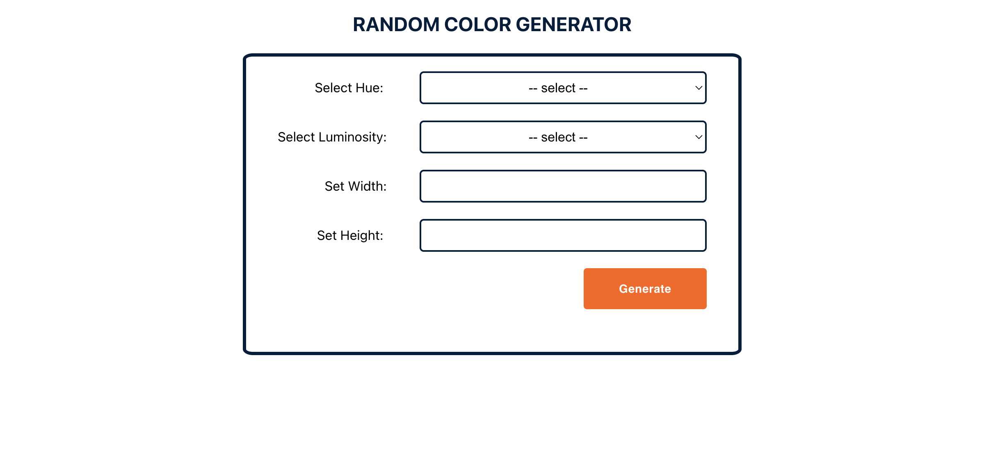

# React Random Color Generator

This application will show a random color when a button is clicked:

- button will cause a new color to be generated when it is clicked
- color is either random or based on hue and/or luminosity
- width and height of generated color box can be set

## Screenshots of the project

  

